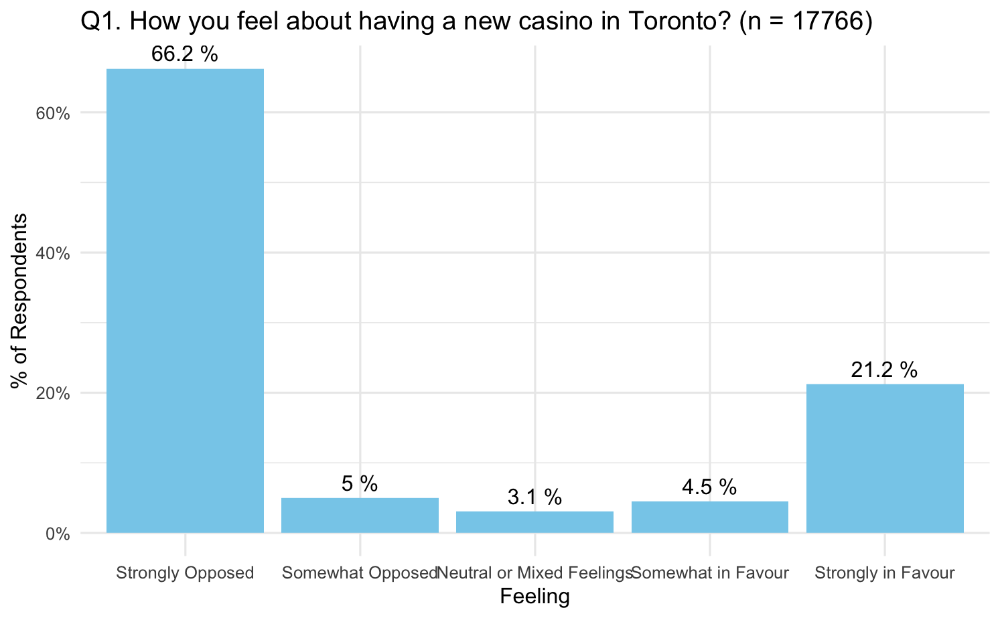
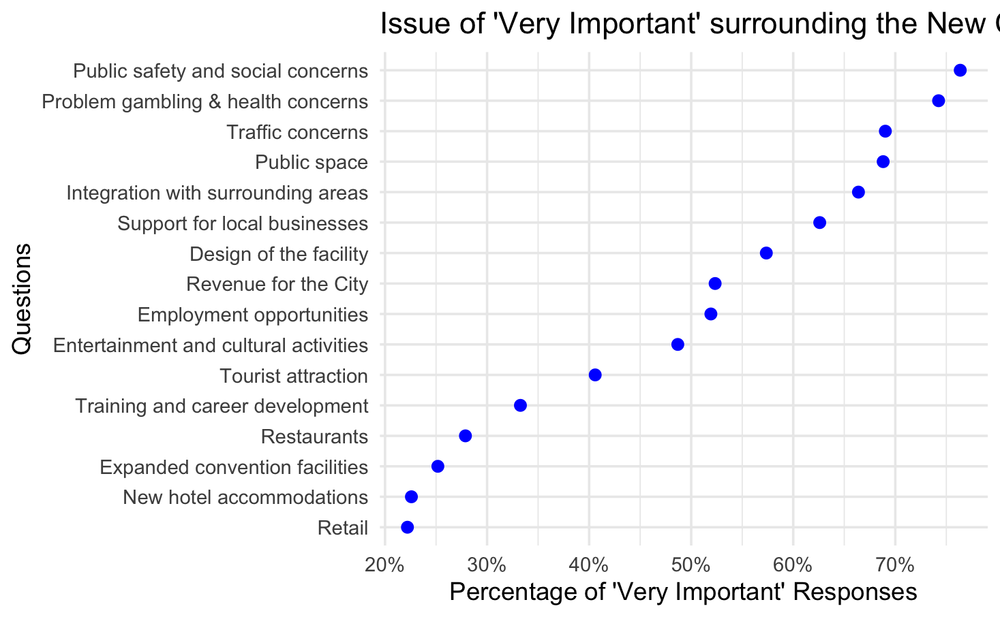

# 🎰 Public Sentiment Analysis on a Proposed Casino in Toronto

A data analysis project to assess public sentiment using survey data (17,000+ responses) collected by the City of Toronto. I used R to clean, model, and interpret opinions around a proposed casino development — applying multinomial logistic regression, PCA, and EFA to uncover key patterns and predictors of public stance.

---

## 🧠 Problem Statement

Toronto officials commissioned a survey to gauge public opinion on a potential casino. This project analyzes:
- Overall support/opposition (`Q1_A`)
- Importance of various factors (`Q3_A`–`Q3_P`)
- Demographic influences (gender, age)

---

## 🎯 Objectives

- ✅ Predict public stance (5-point Likert: strongly favor to strongly oppose)
- ✅ Identify what concerns (e.g., safety, tourism, jobs) drive opinions
- ✅ Reduce dimensionality with **PCA** for clearer interpretation
- ✅ Use **EFA** to uncover latent opinion dimensions
- ✅ Explore sentiment variation by gender & age

---

## 📂 Key Actions Taken

- 🧹 Cleaned and recoded messy survey data (17,766 rows × 92 columns)
- 📈 Modeled casino support using **Multinomial Logistic Regression**
- 📉 Applied **PCA** to reduce dimensionality from 16 → 2 components
- 🔍 Conducted **EFA** to extract underlying themes (e.g., safety vs. economy)
- 📊 Visualized results with `ggplot2` and custom `RMarkdown` reporting
- 👤 Analyzed subgroup sentiment differences (e.g., men vs. women)

---

## 📊 Data Summary

- **File**: `casino_survey_results20130325.csv`
- **Target**: `Q1_A` – *"How do you feel about having a new casino in Toronto?"*
- **Predictors**: 16 concern factors (`Q3_A`–`Q3_P`, 4-point scale)
- **Demographics**: Gender, Age

**Target Variable (`Q1_A`):**  
- 1: Strongly in Favour  
- 2: Somewhat in Favour  
- 3: Neutral or Mixed Feelings  
- 4: Somewhat Opposed  
- 5: Strongly Opposed

**Examples of Predictor Factors (`Q3_`):**  
- `Q3_B`: Employment opportunities  
- `Q3_L`: Revenue for the City  
- `Q3_G`: Problem gambling & health  
- `Q3_H`: Public safety  

---

## 🧼 Data Cleaning & Preparation

| Step                            | Action Taken                                                                 |
|---------------------------------|------------------------------------------------------------------------------|
| Missing Values (Q1_A)           | Imputed with mode → **"Strongly Opposed"**                                  |
| Missing Values (Q3_A–Q3_P)      | Replaced with **"Unsure"** to capture uncertainty                           |
| Dropped Variables               | Removed irrelevant text/demographic fields (`Q1_B1`, `Q3_Comments`, etc.)    |
| Factor Encoding                 | Recoded Likert responses into ordinal & categorical formats                  |
| Covariates                      | Gender, Age (grouped, with "Prefer not to disclose" for NAs)                 |

---

## 📊 Data Visualization

### Casino Sentiment Distribution

### "Very Important" % for Each Factor

---

## 🔮 Predictive Modeling (Multinomial Logistic Regression)

- Target: Q1_A (public stance)
- Features: Q3_A to Q3_P (importance of 16 factors)
- Accuracy: High for extreme stances (Strongly Opposed/Favour); lower for Neutral

### Key Predictive Factors:
- 🏙️ `Q3_N`: Tourist Attraction (**strongest predictor of favorability**)
- 💼 `Q3_B`: Employment
- 🏨 `Q3_F`: Hotel Accommodations
- 💰 `Q3_L`: Revenue for the City

---

## 📉 Dimensionality Reduction (PCA)

- Converted 16 Q3 factors → **2 Principal Components**
- Explained **61.87%** of variance  
  - PC1: Economic Development (42.64%)
  - PC2: Social Concerns (19.23%)
- Re-fit model using PCs → **same performance**, less complexity

---

## 🔍 Exploratory Factor Analysis (EFA)

- Used Maximum Likelihood with Varimax rotation
- Identified **two latent factors**:
  - **Economic Development & Infrastructure**
  - **Social Concerns & Public Safety**

### Gender Analysis:
- **Males**: Prioritized economic growth
- **Females**: Focused on safety & social concerns

---

## ✅ Key Insights

- **66.2% of respondents strongly opposed** the casino  
- Favorability driven by **economic benefit perception**
- Opposition linked to **public health, safety, and urban integration concerns**
- PCA & EFA offered interpretable, reduced-dimensional views with actionable themes

---

## 🧰 Tools & Libraries

- `R`  
- `tidyverse` for data wrangling  
- `nnet` for multinomial logistic regression  
- `psych` for factor analysis  
- `FactoMineR`, `factoextra` for PCA  
- `ggplot2` for visualization  

---

## 👩‍💻 About Me

**Huyen Pham** – Data Analyst passionate about public policy, urban planning, and using data to inform real-world decisions.  
> *This project demonstrates my ability to clean, model, visualize, and interpret complex public opinion data using R.*

---

